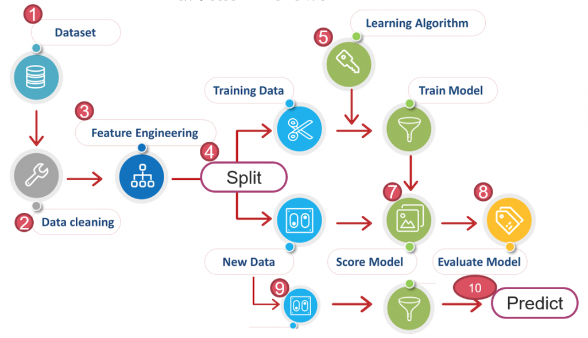
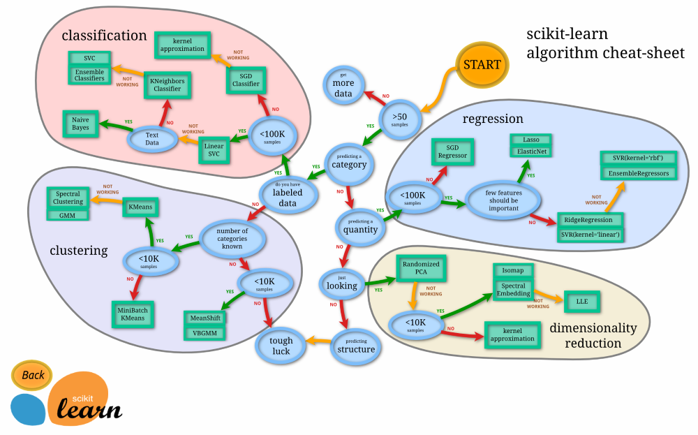
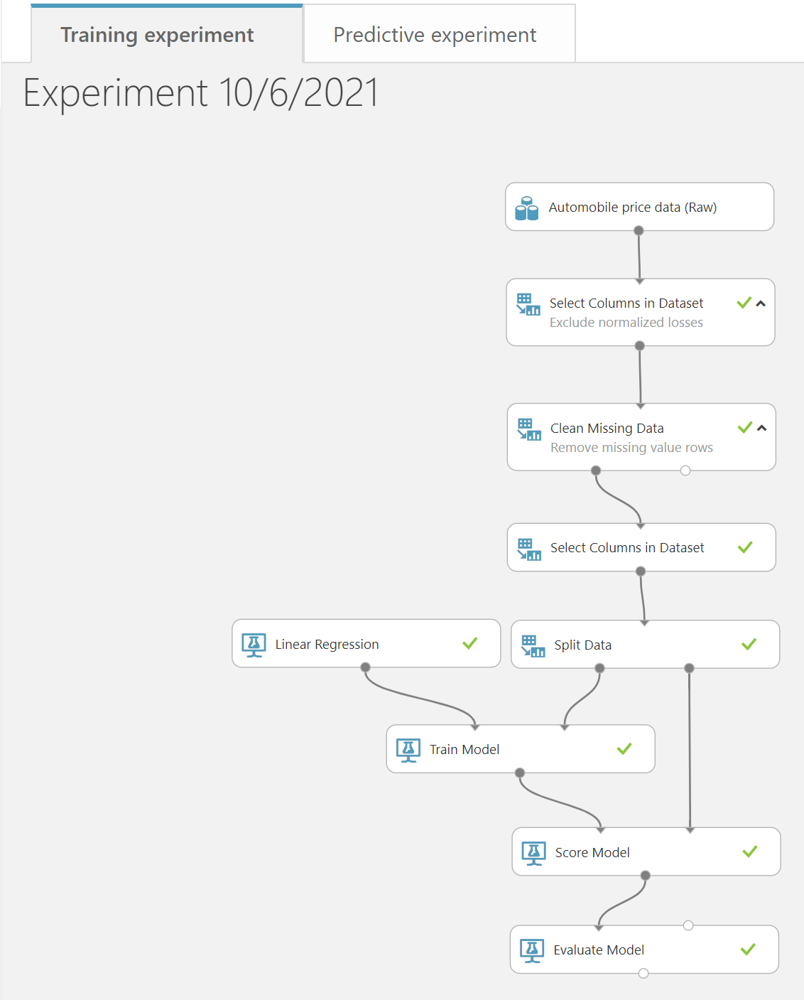
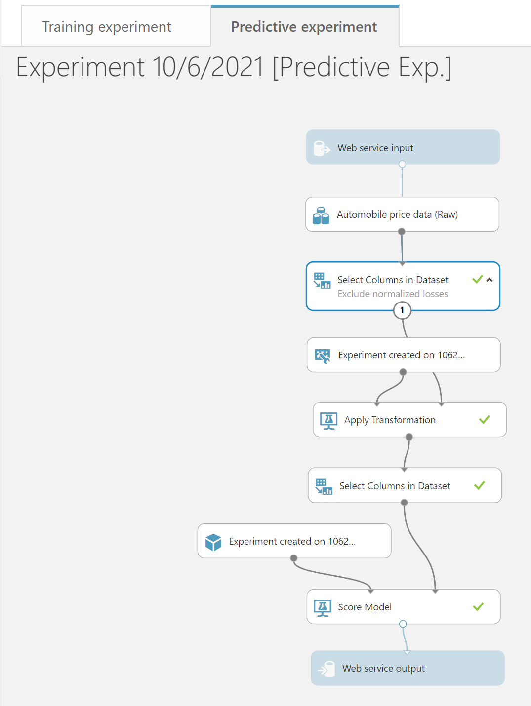

# azure-machine-learning-studio

source: [https://yourfreetemplates.com/free-machine-learning-diagram/](https://yourfreetemplates.com/free-machine-learning-diagram/)

source: [https://scikit-learn.org/stable/tutorial/machine_learning_map/](https://scikit-learn.org/stable/tutorial/machine_learning_map/)

screenshot from [https://studio.azureml.net/](https://studio.azureml.net/)

## reference

[用 Microsoft Azure Machine Learning Studio 學 AI](https://ithelp.ithome.com.tw/articles/10200671)

[Create your first data science experiment](https://docs.microsoft.com/en-us/azure/machine-learning/classic/create-experiment)

[機器學習新手入門工具 Azure Machine Learning Studio](https://www.youtube.com/watch?v=ffZeXkAUZNQ)

[以 Azure Machine Learning Studio預測鐵達尼號乘客生存率](https://medium.com/ashes-tech-talk/%E4%B8%8D%E6%9C%83%E5%AF%AB%E7%A8%8B%E5%BC%8F%E4%B9%9F%E8%83%BD%E5%81%9A-%E4%BB%A5-azure-machine-learning-studio%E9%A0%90%E6%B8%AC%E9%90%B5%E9%81%94%E5%B0%BC%E8%99%9F%E4%B9%98%E5%AE%A2%E7%94%9F%E5%AD%98%E7%8E%87-6873a6195fdc)
